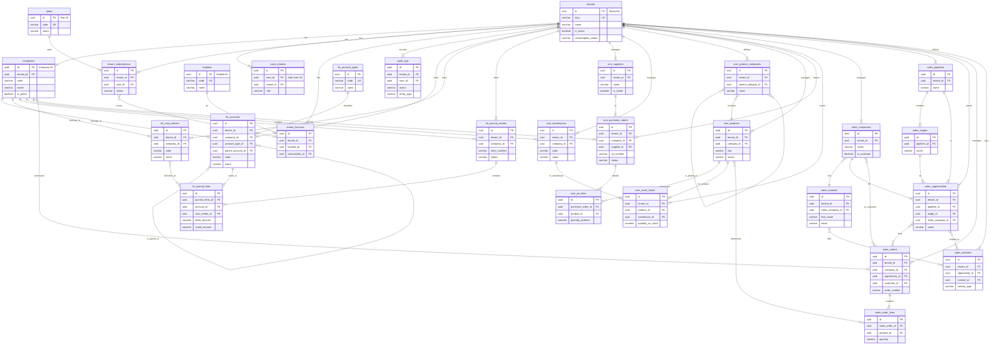

# Diagrama de Entidad-Relación de la Base de Datos

Este diagrama visualiza la arquitectura de la base de datos del ERP, mostrando las tablas y sus relaciones.

```mermaid
erDiagram
    %% ==================================
    %%         CORE & TENANCY
    %% ==================================
    tenants {
        uuid id PK "Tenant ID"
        varchar slug UK
        varchar name
        boolean is_active
        varchar csubscription_status
    }
    companies {
        uuid id PK "Company ID"
        uuid tenant_id FK
        varchar code
        varchar name
        boolean is_active
    }
    users_tenants {
        uuid id PK
        uuid user_id FK "Auth User ID"
        uuid tenant_id FK
        varchar role
    }
    plans {
        uuid id PK "Plan ID"
        varchar code UK
        varchar name
    }
    modules {
        uuid id PK "Module ID"
        varchar code UK
        varchar name
    }
    tenant_subscriptions {
        uuid id PK
        uuid tenant_id FK
        uuid plan_id FK
        varchar status
    }
    tenant_licenses {
        uuid id PK
        uuid tenant_id FK
        uuid module_id FK
        uuid subscription_id FK
    }
    audit_logs {
        uuid id PK
        uuid tenant_id FK
        uuid user_id FK
        varchar action
        varchar entity_type
    }

    %% ==================================
    %%            FINANCE (FIN)
    %% ==================================
    fin_account_types {
        uuid id PK
        varchar code UK
        varchar name
    }
    fin_accounts {
        uuid id PK
        uuid tenant_id FK
        uuid company_id FK
        uuid account_type_id FK
        uuid parent_account_id FK
        varchar code
        varchar name
    }
    fin_cost_centers {
        uuid id PK
        uuid tenant_id FK
        uuid company_id FK
        varchar code
        varchar name
    }
    fin_journal_entries {
        uuid id PK
        uuid tenant_id FK
        uuid company_id FK
        varchar entry_number
        varchar status
    }
    fin_journal_lines {
        uuid id PK
        uuid journal_entry_id FK
        uuid account_id FK
        uuid cost_center_id FK
        numeric debit_amount
        numeric credit_amount
    }

    %% ==================================
    %%     SUPPLY CHAIN MGMT (SCM)
    %% ==================================
    scm_suppliers {
        uuid id PK
        uuid tenant_id FK
        varchar name
        boolean is_active
    }
    scm_warehouses {
        uuid id PK
        uuid tenant_id FK
        uuid company_id FK
        varchar code
        varchar name
    }
    scm_product_categories {
        uuid id PK
        uuid tenant_id FK
        uuid parent_category_id FK
        varchar name
    }
    scm_products {
        uuid id PK
        uuid tenant_id FK
        uuid category_id FK
        varchar sku
        varchar name
    }
    scm_purchase_orders {
        uuid id PK
        uuid tenant_id FK
        uuid company_id FK
        uuid supplier_id FK
        varchar po_number
        varchar status
    }
    scm_po_lines {
        uuid id PK
        uuid purchase_order_id FK
        uuid product_id FK
        numeric quantity_ordered
    }
    scm_stock_levels {
        uuid id PK
        uuid tenant_id FK
        uuid product_id FK
        uuid warehouse_id FK
        numeric quantity_on_hand
    }

    %% ==================================
    %%           SALES / CRM
    %% ==================================
    sales_companies {
        uuid id PK
        uuid tenant_id FK
        varchar name
        boolean is_customer
    }
    sales_contacts {
        uuid id PK
        uuid tenant_id FK
        uuid sales_company_id FK
        varchar first_name
        varchar email
    }
    sales_pipelines {
        uuid id PK
        uuid tenant_id FK
        varchar name
    }
    sales_stages {
        uuid id PK
        uuid pipeline_id FK
        varchar name
    }
    sales_opportunities {
        uuid id PK
        uuid tenant_id FK
        uuid pipeline_id FK
        uuid stage_id FK
        uuid sales_company_id FK
        varchar name
    }
    sales_orders {
        uuid id PK
        uuid tenant_id FK
        uuid company_id FK
        uuid opportunity_id FK
        uuid customer_id FK
        varchar order_number
    }
    sales_order_lines {
        uuid id PK
        uuid sales_order_id FK
        uuid product_id FK
        numeric quantity
    }
    sales_activities {
        uuid id PK
        uuid tenant_id FK
        uuid opportunity_id FK
        uuid contact_id FK
        varchar activity_type
    }

    %% ==================================
    %%           RELATIONSHIPS
    %% ==================================
    %% --- Core Relationships ---
    tenants ||--|{ companies : "has"
    tenants ||--|{ users_tenants : "has"
    tenants ||--|{ tenant_subscriptions : "has"
    plans ||--|{ tenant_subscriptions : "uses"
    tenants ||--|{ tenant_licenses : "has"
    modules ||--|{ tenant_licenses : "for"
    tenant_subscriptions }o--o| tenant_licenses : "covers"
    tenants ||--|{ audit_logs : "records"

    %% --- Finance Relationships ---
    tenants ||--|{ fin_accounts : "owns"
    companies ||--|{ fin_accounts : "belongs_to"
    fin_account_types ||--|{ fin_accounts : "classifies"
    fin_accounts }o--o{ fin_accounts : "is_parent_of"
    tenants ||--|{ fin_cost_centers : "owns"
    companies ||--|{ fin_cost_centers : "belongs_to"
    tenants ||--|{ fin_journal_entries : "owns"
    companies ||--|{ fin_journal_entries : "for"
    fin_journal_entries ||--|{ fin_journal_lines : "contains"
    fin_accounts ||--|{ fin_journal_lines : "posts_to"
    fin_cost_centers }o--o{ fin_journal_lines : "allocates_to"

    %% --- SCM Relationships ---
    tenants ||--|{ scm_suppliers : "manages"
    tenants ||--|{ scm_warehouses : "manages"
    companies ||--|{ scm_warehouses : "contains"
    tenants ||--|{ scm_product_categories : "defines"
    scm_product_categories }o--o{ scm_product_categories : "is_parent_of"
    tenants ||--|{ scm_products : "manages"
    scm_product_categories }o--|| scm_products : "contains"
    tenants ||--|{ scm_purchase_orders : "issues"
    companies ||--|{ scm_purchase_orders : "for"
    scm_suppliers ||--|{ scm_purchase_orders : "to"
    scm_purchase_orders ||--|{ scm_po_lines : "details"
    scm_products ||--o{ scm_po_lines : "references"
    tenants ||--|{ scm_stock_levels : "tracks"
    scm_products ||--|{ scm_stock_levels : "for_product"
    scm_warehouses ||--|{ scm_stock_levels : "in_warehouse"

    %% --- Sales/CRM Relationships ---
    tenants ||--|{ sales_companies : "manages"
    sales_companies }o--|| sales_contacts : "has"
    tenants ||--|{ sales_pipelines : "defines"
    sales_pipelines ||--|{ sales_stages : "contains"
    tenants ||--|{ sales_opportunities : "tracks"
    sales_pipelines ||--|{ sales_opportunities : "in"
    sales_stages ||--|{ sales_opportunities : "at"
    sales_companies ||--|{ sales_opportunities : "for"
    tenants ||--|{ sales_orders : "manages"
    companies ||--|{ sales_orders : "processes"
    sales_opportunities }o--o{ sales_orders : "from"
    sales_companies }o--o{ sales_orders : "to_customer"
    sales_orders ||--|{ sales_order_lines : "contains"
    scm_products }o--o{ sales_order_lines : "references"
    tenants ||--|{ sales_activities : "logs"
    sales_opportunities }o--o{ sales_activities : "related_to"
    sales_contacts }o--o{ sales_activities : "with"
```
